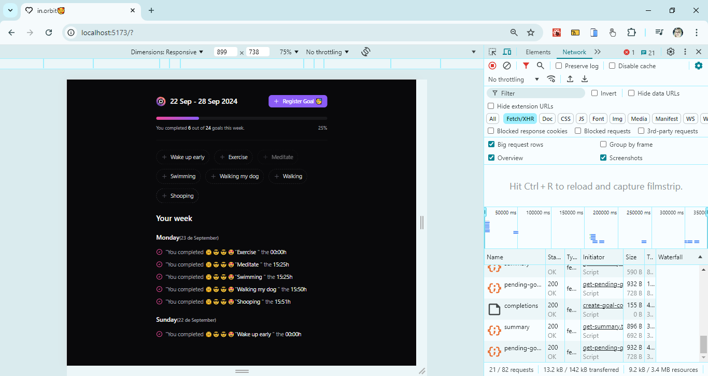
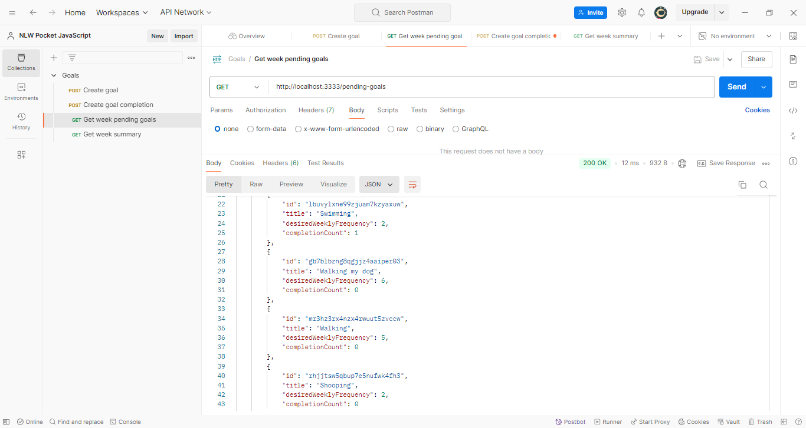

<h2 align="center"> 💻 FullStack project NLW Pocket </h2>
 
<h4 align="center">  - I had the opportunity to take part in #NLW #Pocket with the #Rocketseat team, a Goal Management application where
  the user registers weekly goals and can monitor their score in real time. </h4>
  
  ---

<h4 align="center">Goal Management application 🚀</h4>

<h4 align="center">Front-end - Full-Stack 🚀</h4>
<h3 align="center"></h3>

---

<h4 align="center">Back-end - Full-Stack 🚀</h4>
<h3 align="center"></h3>
 

---

<h4 align="center">Back-end - Docker and DB - seed  🚀</h4>

    
    

---

<h4 align="center">Back-end - Drizzle and Postman  🚀</h4>

    
    

---
<h4 align="center">Back-end - Drizzle consult sql rout and  Drizzle GET consult sql rout  🚀</h4>

    
    

---

<h4 align="center">Front-end - Page start and  Page register goal  🚀</h4>

    
    

---

<h4 align="center">Front-end - Page goal and  Page configuring test  🚀</h4>

    
    

---

<h4 align="center">Front-end - Page create goals front and back and  Page add new goals - Walking my dog  🚀</h4>

    
    

---
<h4 align="center">Front-end - Page front and back add goals - Postman and back and  Page front and back add goals - Postman  🚀</h4>

    
    

---

### 📋 API functionalities

- Create detailed itineraries:** Organize the stages of your trip, including destinations, activities, dates and times.
- Manage important links:** Store links to reservations, flights, hotels, restaurants and other relevant information in one place.
- Share with friends and/or family:** Share your itinerary and links with other members of your trip using just their email address.
---

### 🛠️ Tecnologias Utilizadas

<h4 align="center"> These tools and frameworks together create a modern and efficient development environment, allowing you to build robust and scalable web applications with ease!</h4>

 - Fastify => Web framework for Node.js, optimized for high performance and low resource consumption, facilitating the creation of fast and scalable APIs.  
 - Zod => Library for data validation in TypeScript, allowing you to define validation schemes in a simple and effective way, guaranteeing data integrity.  
 - Drizzle => Lightweight ORM for JavaScript, designed to work with SQL databases, facilitating manipulation and interaction with data through an intuitive interface.  
 - Docker Compose => Tool for defining and managing multi-container applications using YAML files, enabling easy orchestration of services and dependencies.  
 - Vite => Build tool that offers rapid development and optimization for modern applications, with support for ES and Hot Module Replacement (HMR) modules for a smooth development experience.  
 - TailwindCSS => CSS Framework utility that allows you to quickly create custom designs by offering pre-defined classes for styling elements responsively.  
 - React Query => Library to manage server states in React applications, simplifying the process of searching, caching and synchronizing data with APIs.  
 - React Hook Form => Library that simplifies the manipulation of forms in React, providing an effective way to manage validations, submissions and input states.  
 - Biome => Code formatting and static analysis tool focused on JavaScript and TypeScript, offering a unified approach to improving code quality.  

---

### 🚀 Features

 - Register goal: Allows the user to enter a new goal.
 - List goals: Displays all registered goals and allows you to select which ones have been completed.
 - Completed goals: Displays only the goals that have been marked as completed.
 - Open goals: Lists the goals that have not yet been completed.
 - Delete goals: Allows you to delete goals selected by the user.
 - Save data: All goals are saved in a JSON file (goals.json).

---

### 📦 Pre-requisites

 - Node.js: Make sure you have Node.js installed on your machine.
 - NPM packages: The project uses the @inquirer/prompts and fs libraries for prompts and file manipulation.

---

### 📦 Project structure

 - Application's #Back-end with Node.js, you will learn to explore technologies such as Fastify, Zod, Docker Compose, Drizzle ORM and create the database schema and seed, as well as create some of the project's features: goals, pending goals and complete goals. 
 - The #Front-end of the project. Let's start by building the interfaces, creating various components, and then using tools such as Vite, Biome and TailwindCSS!  
 - Application with #API using React Query and form with React Hook Form 

---

# 🎨 Layout
You can view the project layout via the link below:
- [Layout Web](https://www.figma.com/design/OB4CuFIpikW8L0eUUGyMeJ/NLW-Pocket-JS-%E2%80%A2-in.orbit-(Community)?node-id=82-2&node-type=canvas&t=ZvhfxeRBENvJSQqV-0) (Remember that you need to have a Figma account🥰).

### 🔗 Useful links
- **Project Repository:** [https://github.com/ludiemert/Nlw_Pocket_Node_React.git](https://github.com/ludiemert/Nlw_Pocket_Node_React.git)
#### ✒️ Authors
- **Rocketseat**

- #### My LinkedIn - 

#### Contact

#### [**Luciana Diemert**](https://github.com/ludiemert)

🛠 Full-Stack Developer  
📍 São Jose dos Campos – SP - Brazil

&nbsp;
&nbsp;
&nbsp;
&nbsp;

 

------------------
## 🎁 Acknowledgements and dedications

* Thank you #Rocketseat team
